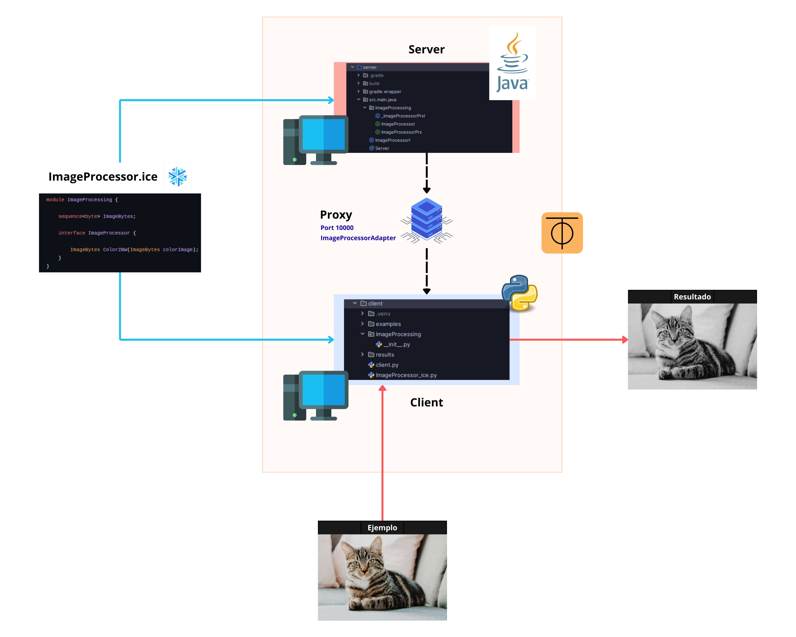

# 🖼️ Image Processor

Un sistema de procesamiento de imágenes distribuido usando Ice (ZeroC). Permite convertir imágenes a color a blanco y negro de forma distribuida entre cliente Python y servidor Java.

## 🏗️ Arquitectura



El sistema utiliza Ice para comunicación entre:
- **Servidor (Java)**: Procesa las imágenes
- **Cliente (Python)**: Envía imágenes y recibe resultados
- **Proxy**: Comunicación a través del puerto 10000

## 📋 Requisitos

### Servidor (Java)
- Java 17
- Gradle 8.x
- Ice 3.7.10

### Cliente (Python)
- Python 3.8 o superior
- pip
- zeroc-ice

## 🚀 Instalación

### 1. Clonar el repositorio
```bash
git clone https://github.com/tu-usuario/image-processor.git
cd image-processor
```

### 2. Configurar el Servidor (Java)

```bash
cd server
./gradlew build
```

### 3. Configurar el Cliente (Python)

```bash
cd client
pip install -r requirements.txt
```

O manualmente:
```bash
pip install zeroc-ice
```

## ▶️ Ejecución

### Iniciar el Servidor

```bash
cd server
./gradlew run
```

Deberías ver:
```
Servidor iniciado...
```

### Ejecutar el Cliente

En otra terminal:

```bash
cd client
python client.py
```

Sigue las instrucciones en pantalla para seleccionar una imagen.

## 🌐 Configuración con ZeroTier (Máquinas diferentes)

### 1. Instalar ZeroTier en ambas máquinas

```bash
curl -s https://install.zerotier.com | sudo bash
```

### 2. Crear red en my.zerotier.com

Registrate y crea una red, copia el Network ID.

### 3. Unir ambas máquinas

```bash
sudo zerotier-cli join <NETWORK_ID>
```

### 4. Obtener IP de ZeroTier

```bash
sudo zerotier-cli listnetworks
```

### 5. Configurar el servidor

En `Server.java`, cambiar a:
```java
"tcp -h 0.0.0.0 -p 10000"
```

### 6. Configurar el cliente

En `client.py`, cambiar a:
```python
proxy_string = "ImageProcessor:tcp -h <IP_ZEROTIER_SERVIDOR> -p 10000"
```

## 📁 Estructura del Proyecto

```
image-processor/
├── slice/
│   ├── ImageProcessing.ice      # Definición de interfaces Ice
├── server/                      # Servidor Java
│   ├── build.gradle
│   ├── src/main/java/
│   │   ├── Server.java
│   │   ├── ImageProcessorI.java
│   │   └── ImageProcessing/     # Código generado por slice2java
├── client/                      # Cliente Python
│   ├── client.py
│   ├── ImageProcessing/         # Código generado por slice2py
│   ├── examples/                # Imágenes de entrada
│   └── results/                 # Imágenes procesadas
└── README.md
```

## 📸 Ejemplos

| Original | Procesada |
|----------|-----------|
|  |  |

## 🛠️ Regenerar código Ice

Si modificas `ImageProcessing.ice`:

```bash
# Para Java
slice2java ImageProcessing.ice

# Para Python
slice2py ImageProcessing.ice
```

## 👥 Integrantes

- Millaray Trangol
- Nelson Sandoval
- Francisco Barrozo
- Camille Elgueta

## 📝 Licencia

Este proyecto fue desarrollado como parte de un trabajo académico.
